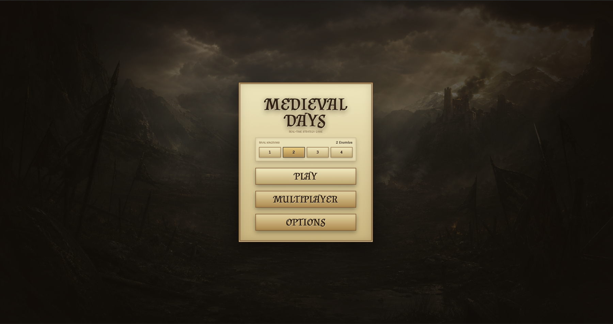
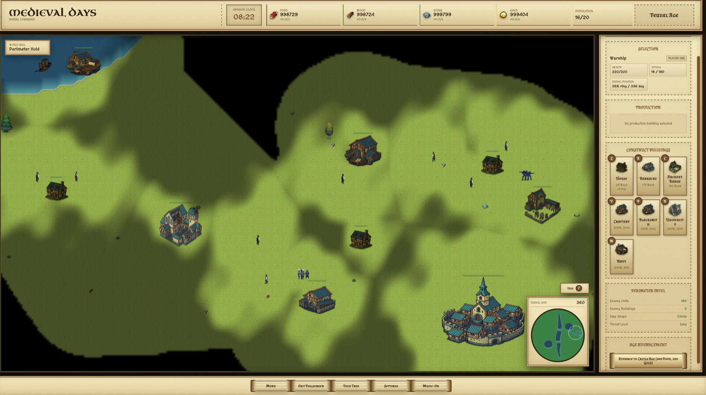
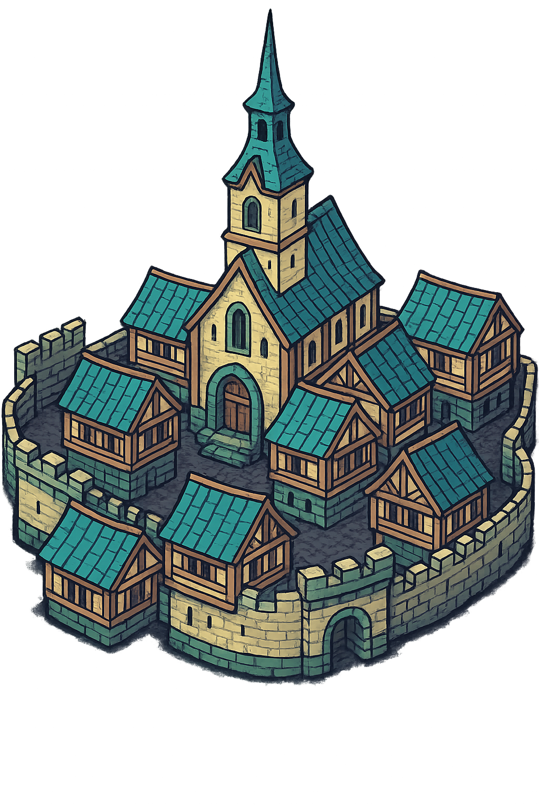
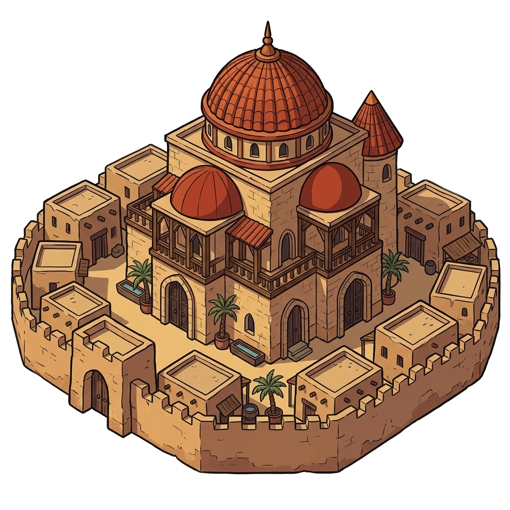
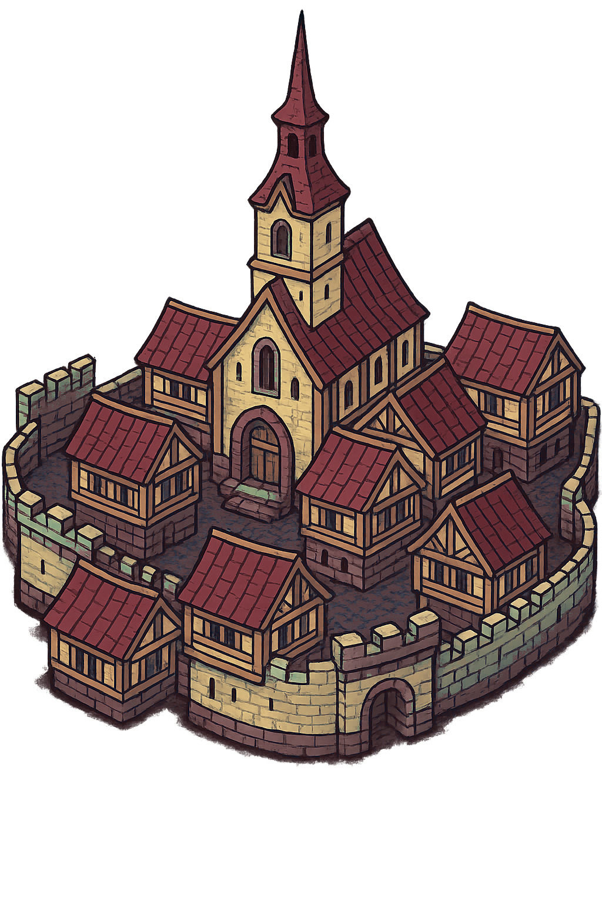
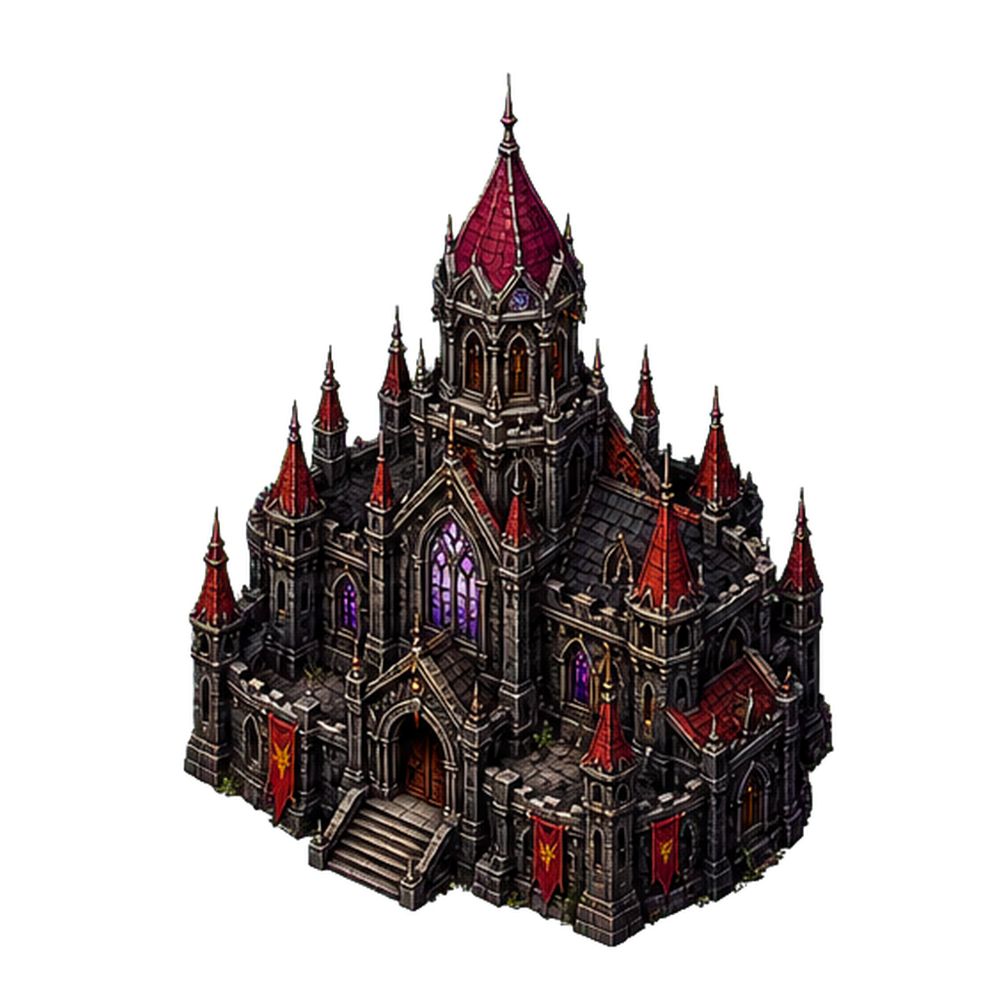
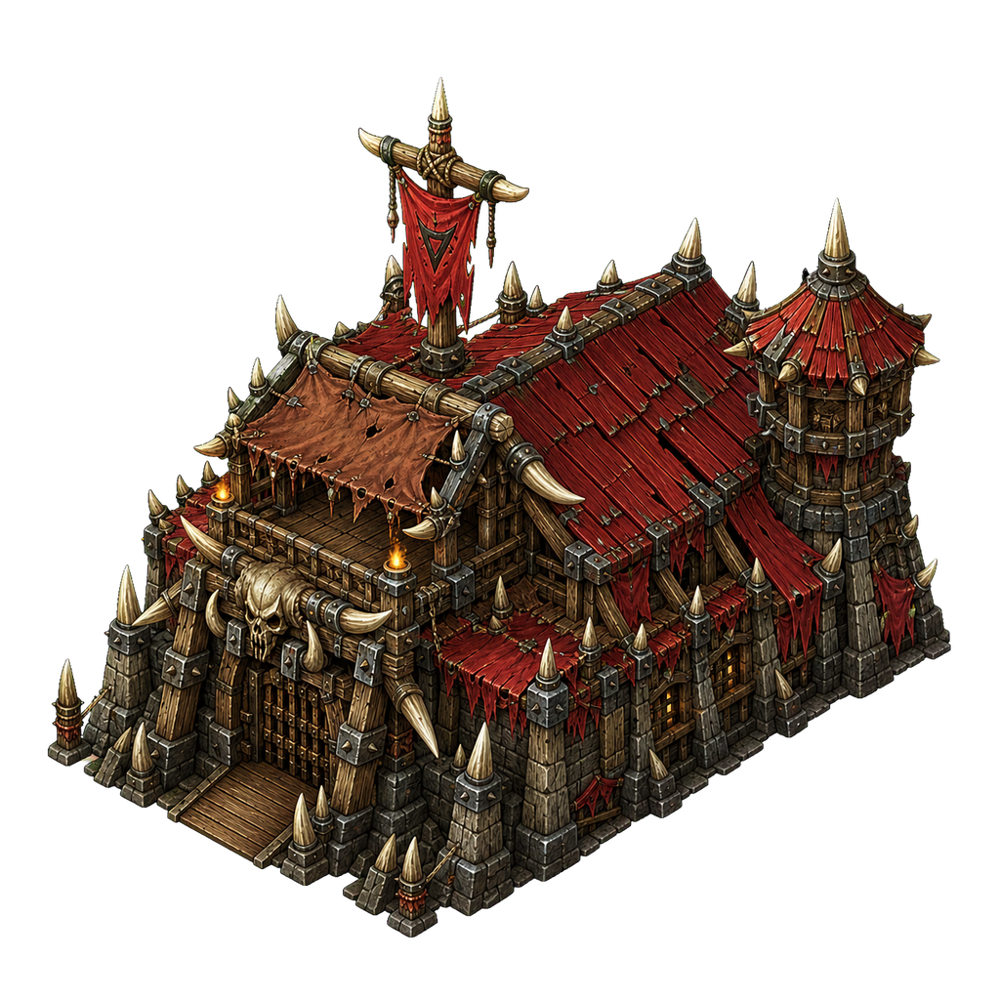

a medieval rts game for showcase

# you can play it from here: https://tunasafa.github.io/medieaval-days/

right now it is playable strategy game mostly for showing what is being done than a good storyline
the more it is played the more bugs and failures will be notices since it is extremely hard to make games like these and think about 10000 aspects of every element
if you notice a bug or fatal error please let me know for future updates and improvements

# i am open to partnering to develop this game further.

version 0:

# v1.0
#  

# current progress / latest version

# player kinds and town centers

there are now different player kinds / faction looks, not only one same kingdom style. the online host stays as player one, the connected friend plays as player two with the desert style, and ai rivals can use other faction asset sets.

| kind | town center | notes |
| --- | --- | --- |
| Player One / Kingdom |  | default local / host player |
| Player Two / Desert |  | connected multiplayer player and desert-style faction |
| Iron Host |  | rival ai faction |
| Night Court |  | rival ai faction with gothic / vampiric style |
| Warlike Clan |  | rival ai faction with jagged warlike style |

latest changes:

- prepared online multiplayer for GitHub Pages by adding a Render free-tier signaling server Blueprint and wiring the game to `wss://medieaval-days-signal.onrender.com`
- made multiplayer players real opposing sides: host is Player One, connected friend is Player Two, with separate units, buildings, resources, population, age, tech, fog of war and command control
- added Player Two desert faction visuals for multiplayer and expanded faction/player-kind support with different town center and building art
- simplified the multiplayer menu so normal players use only Host Room, Join Room, Copy room code, and Start Game, with the server URL hidden under Advanced
- changed building construction so standard buildings are now placed as ghost foundations and must be built by 1-4 selected villagers
- added multi-villager construction speed scaling, with each assigned villager taking a separate border/corner work spot and using the gathering animation while building
- added construction progress bars on foundations and delayed house population until the house is fully built
- added development speed scaling so newly queued units and research complete faster as the player advances ages and completes more technologies
- redesigned the start menu with a battlefield background, cleaner options, and enemy count selection before the match starts
- expanded the game to a large circular map with a circular minimap and click / drag minimap camera navigation
- improved large-map performance with pathfinding cache tuning, lighter minimap rendering, and better unit / asset drawing behavior
- added multiple enemy factions with their own colors and asset sets, including Iron Host, Sun Emirate, Night Court, and Warlike Clan
- improved enemy AI so rival bases expand from safer positions, respect terrain better, and send clearer attack pressure
- added the tech tree and research system with Blacksmith, Town Center, and University upgrades
- added the University building with a custom high-quality building asset
- improved bridge placement so bridges handle wider procedural rivers and connect paths more reliably
- improved bridge visuals and footprints so bridges read better on the terrain
- expanded the background music playlist with local medieval tracks and credits in `assets/music/README.md`
- improved RTS quality-of-life UI, including idle villager tracking, tech tree view, research progress, settings, tooltips, and cleaner command panels
- changed multiplayer networking to WebRTC rooms, using the Node server only for signaling instead of direct-IP gameplay traffic

previous updates:

- improved enemy movement/ai so enemy units use pathfinding and respect terrain better
- improved mechanics for embarking / disembarking units with transport ships
- added visible projectiles for catapult, ballista, archer and crossbowman attacks
- replaced generated music with better 8 bit CC0 medieval chiptune songs

possible future updates:

- special enemy sprites and buildings
- completely isometric tiling map configuration
- more maps
- zoom in and out from the map
- 2 and more player real time playable option
